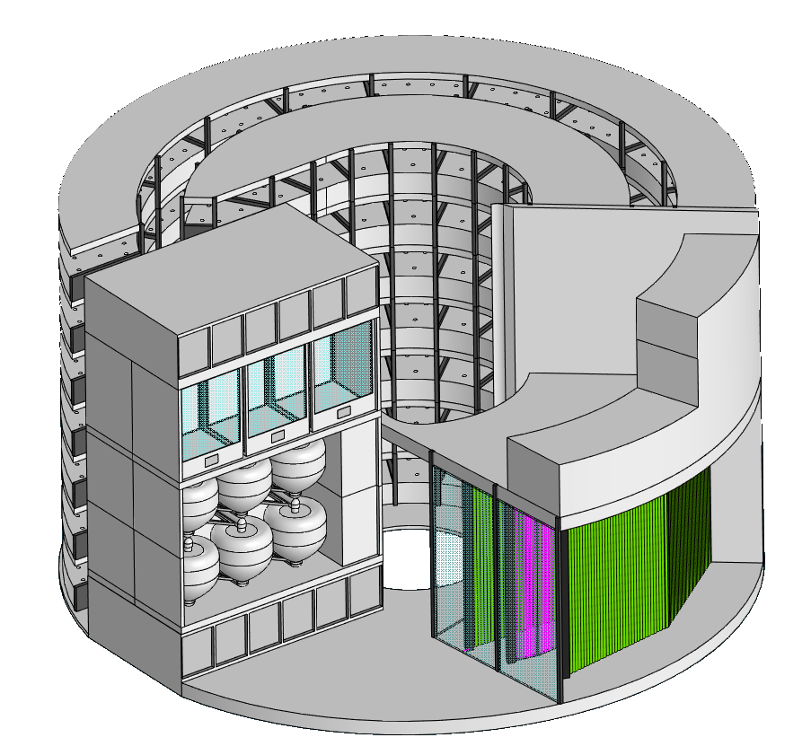
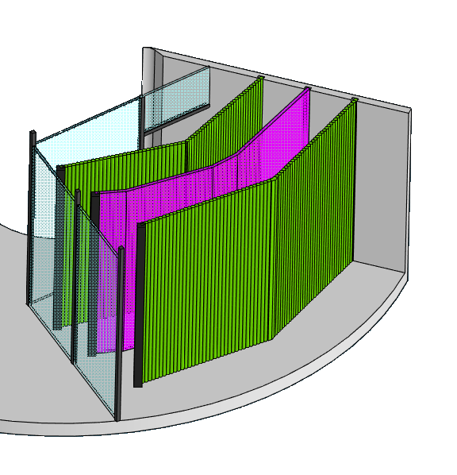
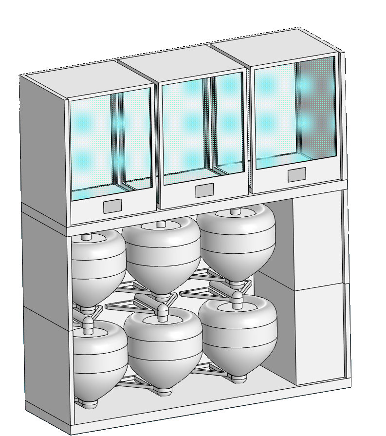
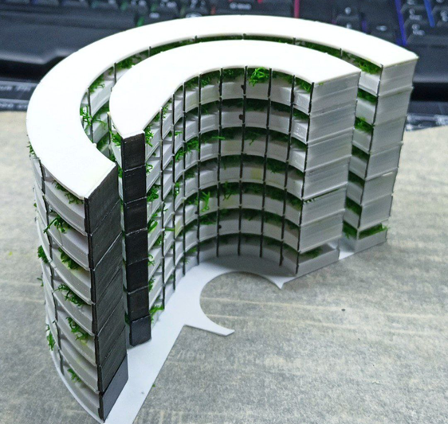
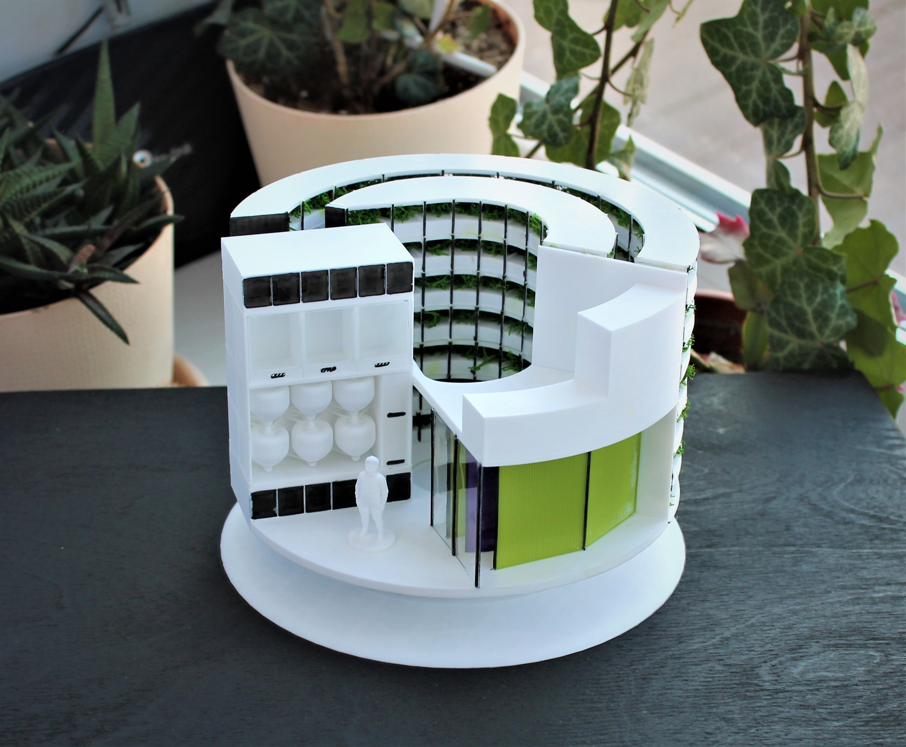

# Биорегенеративная система жизнеобеспечения для межпланетного корабля (БСЖМК)

> Концептуальный инженерный проект автономной биорегенеративной системы жизнеобеспечения для длительных межпланетных миссий.

---

## Обзор

Проект представляет собой концепцию **биорегенеративной системы жизнеобеспечения (BLSS)**, рассчитанной на поддержку экипажа из **10 астронавтов** в течение примерно **1000-дневной миссии на Марс**.

Идея системы основана на замкнутом цикле переработки ресурсов с минимизацией зависимости от поставок с Земли. Все модули спроектированы с учётом размещения внутри гермообъёма **Starship SpaceX**.

---

## Состав проекта

В проект входят:

- инженерные расчёты  
- 3D CAD-модели сделанные в KOMPAS-3D
- физический 3D-печатный прототип  
- исследовательская работа  
- презентационные материалы  

---

# Полная система

Полная компоновка биорегенеративной системы жизнеобеспечения.

  

---

# Основные модули

## Фотобиореактор

Фотобиореактор использует хлореллу для регенерации атмосферы и получения биомассы.

**Функции:**
- выработка кислорода  
- поглощение углекислого газа  
- получение белковой биомассы  

  

---

## Модуль насекомых

Система переработки органических отходов на основе личинок чёрной львинки.

**Функции:**
- переработка органических отходов  
- получение белка и жиров  
- возврат питательных веществ в цикл  

  

---

## Аэропонная теплица

Семиярусная аэропонная теплица для производства пищи.

**Основные культуры:**
- батат
- картошка 

**Дополнительные культуры:**
- пшеница  
- амарант  
- салатные культуры  
- пряные растения
- овощи

  

---

# Физический прототип

Масштабная демонстрационная модель **1:60**, изготовленная методом **FDM 3D-печати (PLA)**.

Модель была собрана, окрашена и использовалась на защите проекта.

  

---

# Технические характеристики

| Параметр | Значение |
|----------|----------|
| Экипаж | 10 человек |
| Длительность миссии | ~1000 суток |
| Объём фотобиореактора | 494 л |
| Производство кислорода | 10.3 кг/сутки |
| Площадь теплицы | 161 м² |
| Модули насекомых | 12 |
| Масштаб прототипа | 1:60 |

---

# Технологии

- KOMPAS-3D  
- инженерные расчёты  
- математическое моделирование  
- FDM 3D-печать  
- PLA  
- CAD-проектирование  

---

# Статус проекта

- ✅ Концепция разработана  
- ✅ Инженерные расчёты выполнены  
- ✅ Создана полная CAD-сборка  
- ✅ Изготовлен физический прототип  

- ⬜ Динамическое моделирование экосистемы  
- ⬜ Система автоматического управления  
- ⬜ CFD и тепловой анализ  

---

# Дальнейшее развитие

Возможные направления развития:

- автоматизация управления средой  
- роботизированное обслуживание модулей  
- оптимизация энергопотребления  
- создание цифрового двойника  
- интеграция с лунными и марсианскими базами  
- долгосрочное моделирование экосистем
- решение проблем с микрогравитацией у фотобиореактора и аэропоники

---

# Примечание

Проект является концептуальным инженерным исследованием и предназначен для образовательных целей.

Система не является готовой к космическому применению, но демонстрирует архитектуру будущих автономных систем жизнеобеспечения.

---

# Автор

**Александр Генералов**

Инженерный концепт биорегенеративной системы жизнеобеспечения для длительных космических миссий.
